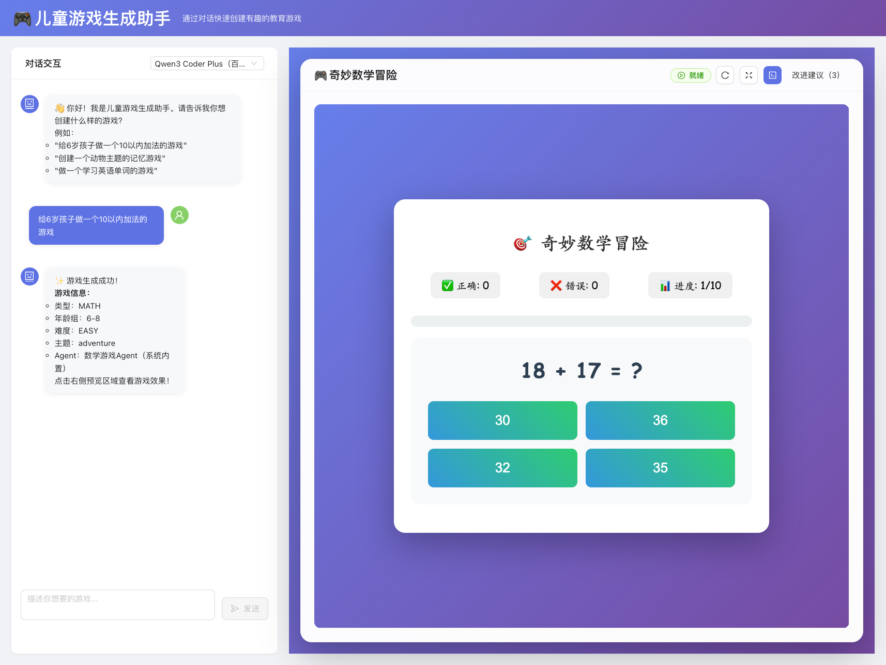
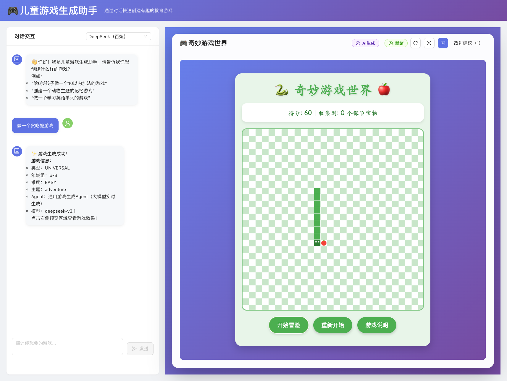
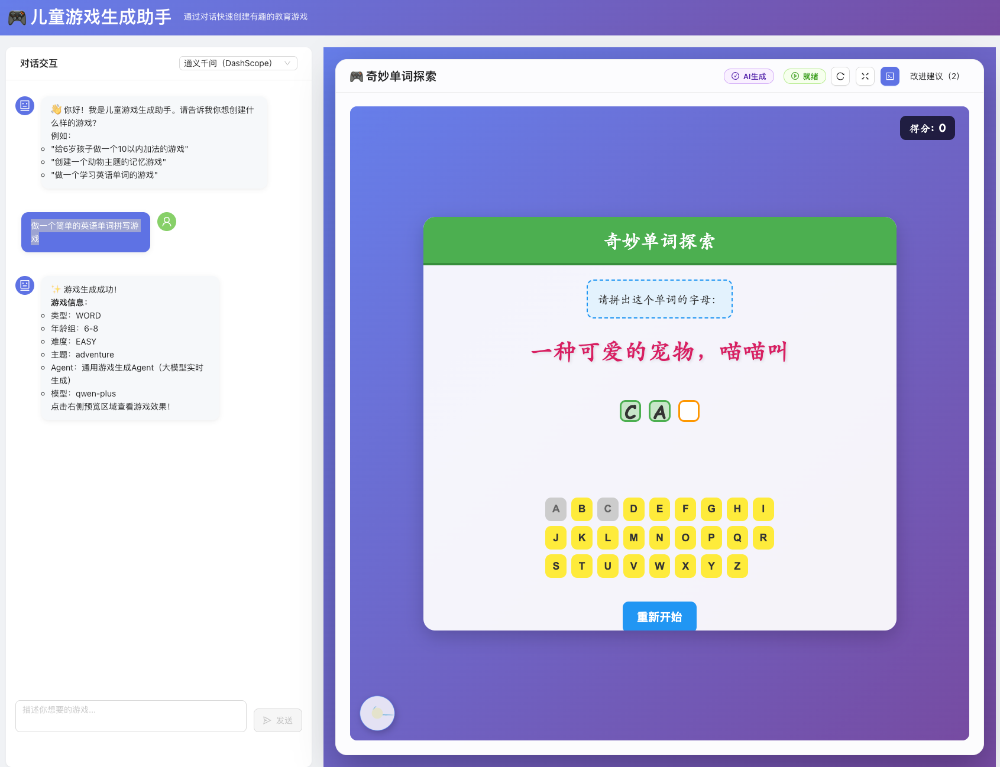

# 曾经
曾经：希望有个游戏机，里面有无限的游戏。而不是一个俄罗斯方块玩几年。

于是：
自己做一个喽。
给儿子玩。
他有了无限的游戏。

# 🎮 儿童游戏生成 Agent 框架

用自然语言，一键生成可玩的儿童教育游戏。Java + React，插件化 Agent 架构，支持阿里云百炼（通义千问/Kimi/DeepSeek/Qwen3），可选 RAG，内置离线游戏模板。

自带游戏


模型生成游戏

一句话生成一个贪吃蛇游戏。



做一个简单的英语单词拼写游戏



[](#)
[](#)
[](#)
[](#)
[](#)
[](#)

## 你能用它做什么

- 亲子计划的一部分。
- 用中文描述生成教育小游戏（数学/记忆/词汇/拼图/自由玩法）。
- 设置年龄段/难度/主题，秒级预览并一键导出 HTML。
- 接入你自己的 Agent 与模板，沉淀专属内容库。
- 可选 RAG（Elasticsearch/内存）做教材/课程定制练习。
- 熟悉Agent架构与大模型集成的示例。

## 特性一览

- 🤖 智能对话生成：大模型直出完整 HTML（内联 CSS/JS）。
- 🧩 内置系统游戏：离线可用（数学/记忆等）。
- 🔌 插件化 Agent：注册即用、低耦合。
- 🛰️ 多模型路由（百炼）：
    - dashscope 默认（通义千问）
    - kimi-k2（Moonshot-Kimi-K2-Instruct）
    - qwen3-coder-plus（Qwen3 Coder Plus）
    - deepseek（deepseek-v3.1）
- 🧠 RAG 可选：Elasticsearch/内存，两行命令起停。
- 🔭 可观测：响应标注“系统内置/大模型 + 模型名”，日志输出提示词（DEBUG）。

## 为什么值得 Star

- 说人话就能做游戏：一句自然语言 → 可运行 HTML5 游戏。
- 两条腿走路：内置系统游戏 + 大模型实时生成，离线/在线都能玩。
- 真·可观测：响应卡片显示“来源与模型”，Debug 日志输出完整提示词（System/User）。
- 真·可扩展：插件化 Agent 架构，新增一个类即可接入新玩法。
- 真·可落地：脚本一键起（后端 8088），RAG/代理都是可选项。

## 快速开始

环境要求：Java 17+、Maven 3.6+、Node.js 18+（建议 20）；可选 Docker（Elasticsearch）。

### 🚀 超轻量一键启动（推荐）

```bash
# 一键启动 - 自动检查环境、安装依赖、配置参数、启动服务
./quick_start.sh

# 带 API Key 启动（跳过交互）
ALIYUN_API_KEY=你的百炼Key ./quick_start.sh
```

**特性**：
- 🔍 自动环境检查与修复建议
- 📦 自动安装依赖（Maven/npm）
- 🔑 智能 API Key 配置（环境变量/.env/交互输入）
- 🚀 并行启动前端后端，健康检查确保就绪
- 🎨 彩色输出与进度提示
- 🔄 Ctrl+C 优雅清理所有服务

### 传统启动方式

1) 使用 start.sh 脚本：
```bash
export ALIYUN_API_KEY=你的百炼Key
./start.sh
```

2) 手动启动：
```bash
# 后端
cd game-agent-backend
mvn spring-boot:run                   # 默认 8088
SERVER_PORT=8090 mvn spring-boot:run  # 指定端口

# 前端
cd ../game-agent-frontend
npm install && npm run dev            # 默认代理 http://localhost:8088
BACKEND_URL=http://localhost:8090 npm run dev
```

### 访问地址

- 前端：http://localhost:5173（Vite）
- 后端：http://localhost:8088（可用 `SERVER_PORT` 覆盖）

## 架构速览（V2 — 当前）

### 设计哲学："LLM 负责理解，代码只做代码该做的事"

| 维度 | V1（旧） | V2（现） |
|---|---|---|
| **任务决策** | Java 规则引擎匹配 GameType | LLM 通过 Function Calling 自主决策 |
| **游戏生成** | 硬编码子 Agent，单次调用 | AgentLoop 多轮迭代：生成 → 评估 → 修复 |
| **质量保障** | 无（生成即交付） | Playwright headless + 代码检查 + 自动修复 |
| **扩展方式** | 写一个新 Java 类 | 写一个 SKILL.md 文件 |

### 执行流程

```
"生成一个记忆翻牌游戏"
  │
  ▼
AgentLoop
  └─ ChatClient.call()  ← 一次调用，Spring AI 内部自动多轮 FC
       │
       ├─ loadSkill("memory_master")
       │    → LLM 读 SKILL.md 操作手册（生成步骤/评估重点/常见问题）
       │
       ├─ generateGame(design)
       │    → 带着 Skill 知识生成 HTML
       │
       ├─ evaluateGame(html)
       │    → Playwright 渲染 + Probe 注入 + 五维评分
       │    → 评分 < 80 → 继续
       │
       ├─ fixGame(issues)
       │    → LLM 已读过 SKILL.md "常见问题"段，带领域知识修复
       │
       └─ evaluateGame(html) → 评分 ≥ 80 → 交付
```

### Skill 系统（[AgentSkills.io](https://agentskills.io) 规范）

每个 Skill 是一个目录，不是代码：

```
resources/skills/
├── math_adventure/
│   ├── SKILL.md              # 操作手册（LLM 读这个理解怎么做）
│   └── assets/template.html  # HTML 参考模板
├── memory_master/
├── english_explorer/
├── traffic_safety/
├── shape_colors/
└── logic_puzzle/
```

SKILL.md 分两层：**frontmatter 给机器用**（发现 + 过滤），**body 给 LLM 读**（理解 + 执行）：
```markdown
---
name: math_adventure          # 机器用：匹配、路由
description: 数学加减法游戏...
gameType: quiz
tags: [数学, 加法]
---
# 数学冒险                    # LLM 读：操作手册
## 生成步骤 / ## 评估重点 / ## 常见问题
```

### 后端包结构

```
com.sumo.agent/
├── api/           # REST 端点
├── infra/         # 基础设施（模型配置/存储/Jackson）
├── knowledge/     # RAG 知识层
├── agent/         # 核心域
│   ├── loop/      #   AgentLoop + WorkingMemory
│   ├── tools/     #   5 个 Tool Bean（Skill/Generation/Evaluation）
│   ├── skill/     #   Skill 接口 + SkillLoader（解析 SKILL.md）
│   └── evaluation/#   Playwright GameEvaluator
└── legacy/        # V1 遗留（@Deprecated）
```

### 扩展一个新游戏（V2 方式）

不需要写 Java 代码，创建 SKILL.md 文件即可：

```bash
mkdir -p game-agent-backend/src/main/resources/skills/my_game/assets
```

写 `skills/my_game/SKILL.md`：
```markdown
---
name: my_game
description: 什么游戏、什么时候用。
gameType: quiz
tags: [关键词]
---
# 我的游戏
## 何时使用 / ## 生成步骤 / ## 评估重点 / ## 常见问题
```

重启应用即可生效。

---

## V1 架构（Legacy）

V1 代码保留在 `legacy/` 包中，通过 `POST /api/game/generate` 仍可访问。

```
用户输入 → IntentAnalyzer（规则引擎）→ GameGeneratorAgent → 子 Agent.run()
    ├── MathGameAgent（内置 HTML 模板）
    ├── MemoryGameAgent（内置模板）
    └── UniversalGameAgent（LLM 单次生成）
```

V1 方式扩展：继承 `BaseAgent` 写 Java 类，启动后自动注册。

---

## 配置说明

- 必填：`ALIYUN_API_KEY`（阿里云百炼 API Key）
- 可选：
  - `SERVER_PORT`：后端端口（默认 8088）
  - `AGENT_RAG_TYPE`：`memory`（默认）/ `elasticsearch` / `none`
  - `PROXY_ENABLED/TYPE/HOST/PORT`：代理配置

RAG（可选）：
```bash
docker-compose up -d elasticsearch
```

## API

```bash
# V2（推荐）：AgentLoop 多轮迭代
POST /api/game/v2/generate
{ "userInput": "给6岁孩子做一个10以内加法游戏" }

# V1（兼容）：传统 Agent 单次生成
POST /api/game/generate
{ "userInput": "...", "options": { "model": "deepseek" } }

# Agent 列表
GET /api/game/agents
```

## 路线图

- ~~可玩性自动评分器 + 策略修正回路~~ ✅ 已实现（Playwright + ProbeReport + fixGame）
- ~~Skill 系统~~ ✅ 已实现（SKILL.md + AgentSkills.io 规范）
- 更多学科 Skill（语文/科学/艺术）
- 家长端报告/进度追踪/分级推荐
- WebAssembly 沙盒执行
- 更多模型后端与离线小模型适配

## 贡献

欢迎 PR/Issue！请保证：

- 变更聚焦，避免引入不必要复杂性
- 补充必要说明与示例
- 中文 UTF-8 注释友好

## 许可证

MIT License

## 致谢

Spring Boot / React / 阿里云百炼团队与所有贡献者

---

如果它帮你节省了哪怕 10 分钟，请给它一颗 Star。你的 Star，会让更多孩子更快玩到更好的教育游戏。🌟

