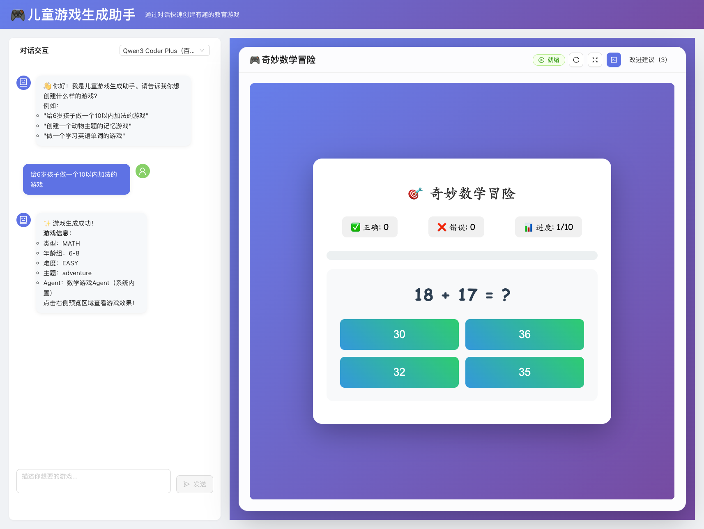

# 🎮 儿童游戏生成 Agent 框架

用自然语言，一键生成可玩的儿童教育游戏。Java + React，插件化 Agent 架构，支持阿里云百炼（通义千问/Kimi/DeepSeek/Qwen3），可选 RAG，内置离线游戏模板。

自带游戏


模型生成游戏


[](#)
[](#)
[](#)
[](#)
[](#)
[](#)

## 你能用它做什么

- 亲子计划的一部分。
- 用中文描述生成教育小游戏（数学/记忆/词汇/拼图/自由玩法）。
- 设置年龄段/难度/主题，秒级预览并一键导出 HTML。
- 接入你自己的 Agent 与模板，沉淀专属内容库。
- 可选 RAG（Elasticsearch/内存）做教材/课程定制练习。
- 熟悉Agent架构与大模型集成的示例。

## 特性一览

- 🤖 智能对话生成：大模型直出完整 HTML（内联 CSS/JS）。
- 🧩 内置系统游戏：离线可用（数学/记忆等）。
- 🔌 插件化 Agent：注册即用、低耦合。
- 🛰️ 多模型路由（百炼）：
    - dashscope 默认（通义千问）
    - kimi-k2（Moonshot-Kimi-K2-Instruct）
    - qwen3-coder-plus（Qwen3 Coder Plus）
    - deepseek（deepseek-v3.1）
- 🧠 RAG 可选：Elasticsearch/内存，两行命令起停。
- 🔭 可观测：响应标注“系统内置/大模型 + 模型名”，日志输出提示词（DEBUG）。

## 为什么值得 Star

- 说人话就能做游戏：一句自然语言 → 可运行 HTML5 游戏。
- 两条腿走路：内置系统游戏 + 大模型实时生成，离线/在线都能玩。
- 真·可观测：响应卡片显示“来源与模型”，Debug 日志输出完整提示词（System/User）。
- 真·可扩展：插件化 Agent 架构，新增一个类即可接入新玩法。
- 真·可落地：脚本一键起（后端 8088），RAG/代理都是可选项。

## 快速开始

环境要求：Java 17+、Maven 3.6+、Node.js 18+（建议 20）；可选 Docker（Elasticsearch）。

1) 启动（推荐）：
```bash
export ALIYUN_API_KEY=你的百炼Key  # 必填：后端从环境变量读取
./start.sh
```

- 前端：http://localhost:5173（Vite）
- 后端：http://localhost:8088（可用 `SERVER_PORT` 覆盖）

2) 手动模式：
```bash
# 后端
cd game-agent-backend
mvn spring-boot:run                   # 默认 8088
SERVER_PORT=8090 mvn spring-boot:run  # 指定端口

# 前端
cd ../game-agent-frontend
npm install && npm run dev            # 默认代理 http://localhost:8088
BACKEND_URL=http://localhost:8090 npm run dev
```

## 架构速览

```
agent_framework_java/
├── game-agent-backend/          # Spring Boot 后端（模型路由/Agent/REST）
│   ├── core/                    # Agent 基类/上下文/调度
│   ├── games/                   # 内置游戏Agent（Math/Memory/Universal）
│   ├── config/                  # 模型配置（DashScope/Kimi/Qwen/DeepSeek）
│   ├── rag/                     # RAG 实现（ES/Memory）
│   └── controller/              # API 路由
├── game-agent-frontend/         # React 前端（Vite + AntD）
│   ├── components/              # 预览容器/聊天交互
│   └── services/                # API 客户端
└── docker-compose.yml           # ES（开发）
```

## 配置说明（最少即可跑）

- 必填环境变量：
  - `ALIYUN_API_KEY`：阿里云百炼 API Key（后端从 `spring.ai.dashscope.api-key` 读取）。

- 可选环境变量：
  - `SERVER_PORT`：后端端口（默认 8088）
  - `BACKEND_URL`：前端代理后端地址（默认 http://localhost:8088）
  - `AGENT_RAG_TYPE`：`elasticsearch | memory | none`（默认 memory）
  - `PROXY_ENABLED/TYPE/HOST/PORT`：为出网模型配置 HTTP/SOCKS5 代理

- RAG（可选）：
```bash
./es-manage.sh                 # 管理脚本
# 或
docker-compose up -d elasticsearch
docker-compose logs -f elasticsearch
```

## 模型与来源可视化

- 响应卡片会显示：`Agent：{名称}（系统内置/大模型实时生成）` 与 `模型：{modelName}`。
- 后端 DEBUG 日志会打印完整提示词（System/User），方便复现与调参。

## API（精简版）

- 生成游戏：
```
POST /api/game/generate
Content-Type: application/json
{
  "userInput": "给6岁孩子做一个10以内加法游戏",
  "options": { "model": "deepseek" }
}
```

- 获取已注册的 Agent 列表：
```
GET /api/game/agents
```

## 开发者指南：扩展一个新游戏 Agent

新建一个类继承 `BaseAgent`，实现 `execute()` 并返回 `{ html, gameData, type }`：
```java
@Component("yourGameAgent")
public class YourGameAgent extends BaseAgent {
    @Override
    public void execute(AgentContext context) {
        // 生成 html / 数据
        context.setResult(Map.of("html", "<!DOCTYPE html>..."));
        context.setSuccess(true);
    }
    @Override public String getName() { return "你的游戏Agent"; }
}
```

启动后会被自动注册；在对话中描述即可触发。

## 路线图（Roadmap）

- 更多学科模板（语文/科学/艺术）与组合玩法
- 可玩性自动评分器 + 策略修正回路
- 家长端报告/进度追踪/分级推荐
- WebAssembly 沙盒执行（更强隔离）
- 更多模型后端与离线小模型适配

## 贡献

欢迎 PR/Issue！请保证：

- 变更聚焦，避免引入不必要复杂性
- 补充必要说明与示例
- 中文 UTF-8 注释友好

## 许可证

MIT License

## 致谢

Spring Boot / React / 阿里云百炼团队与所有贡献者

---

如果它帮你节省了哪怕 10 分钟，请给它一颗 Star。你的 Star，会让更多孩子更快玩到更好的教育游戏。🌟

